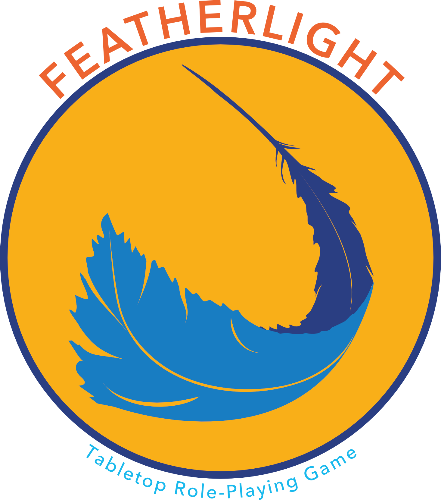

## Welcome to _Featherlight!_

Tabletop role-playing games (TTRPGs) are a fun method of group storytelling, but complicated rule systems and steep initial learning curves often stop people from participating. To help more people enter the world of TTRPGs, _Featherlight_ is a TTRPG that is built to have lightweight, flexible rules that are easy to learn and can apply to any setting!

It takes fewer than 20 minutes to learn the rules of _Featherlight_ well enough to play the game and maybe twice that time investment to be able to serve as the game master (GM) responsible for helping a group of players navigate the world.

If you want to sit down with your friends and quickly start telling a story together, _Featherlight_ enables you to quickly get into the action while still allowing for the randomness introduced by using dice to determine success or failure! And that's regardless of whether the story is set in the world of a beloved book, favorite anime, personal homebrew setting, or somewhere else entirely.

In short, **_Featherlight_ is built to be the backdrop for you to take big narrative swings in whatever setting sparks the most joy for your table**. Have fun and good luck!

:::{.panel-tabset}
### Core Rulebook

**The core rulebook of _Featherlight_ is available now!** Click the download link below to get the PDF from  itch.io.

<iframe frameborder="0" src="https://itch.io/embed/3873197?linkback=true&amp;link_color=077DC2&amp;border_color=283E82" width="600" height="167"><a href="https://toothsome-games.itch.io/featherlight-ttrpg">Featherlight Rulebook by Toothsome Games</a></iframe>

It's PWYW ("pay what you want") but if your budget can support it, $5 would be amazing and would go to support me in commissioning artists for the two custom _Featherlight_ settings that I am working on.

Once I have setting / character art, I'll be releasing new versions of the rulebook that include worldbuilding information and quest hooks for both settings as well as the lovely images that will help bring them to life.

### Quick-Start Guide

A one-page, 'quick-start' guide to Featherlight is also available on  itch.io _for free!_ Check it out for an at-a-glance overview of the fundamental mechanics of Featherlight!

<iframe frameborder="0" src="https://itch.io/embed/4561528?linkback=true&amp;link_color=077DC2&amp;border_color=283E82" width="600" height="167"><a href="https://toothsome-games.itch.io/featherlight-quickstart">Featherlight Quick-Start Guide by Toothsome Games</a></iframe>

If you like what you see in this guide, consider checking out [the full rulebook](https://toothsome-games.itch.io/featherlight-ttrpg) for useful graphics, more description, and tips for those interested in running a Featherlight game at their table!

### Character Sheet

You can use any piece of scratch paper as a character sheet for _Featherlight_ but if you'd prefer a more formal character sheet, **download one [here](https://github.com/toothsome-games/featherlight-ttrpg/blob/main/resources/featherlight_character-sheet.png)**. The download icon () is just above the top right corner of the image after you click that link.

If you print this at home, do two sheets per standard (US letter) piece of paper because the sheet is designed to be the size of a postcard (4x6") so two should fit reasonably nicely on a 8.5x11" piece of paper.

:::

## Following _Featherlight_

To stay up-to-date on _Featherlight_ news, you can:

- Follow it on  Tumblr ([tumblr.com/featherlight-ttrpg](https://www.tumblr.com/featherlight-ttrpg))
- Check it out on  itch.io ([toothsome-games.itch.io/featherlight-ttrpg](https://toothsome-games.itch.io/featherlight-ttrpg))
- Consider becoming a patron on  Patreon ([patreon.com/c/ToothsomeGames](https://www.patreon.com/c/ToothsomeGames))
- Or just keep an eye on this website!

### Feedback

If you've played a _Featherlight_ session, served as the game master, or even just read the rulebook and want to share feedback: thank you! **_Featherlight_ is a labor of love and it can only be improved by hearing what worked (or didn't) in your experiences at home with the game.**

If you have feedback, please send me an email (nickjlyon \[at\] gmail \[dot\] com) or message me on  Tumblr ([\@featherlight-ttrpg](https://www.tumblr.com/featherlight-ttrpg)) and we can chat!

## Note on Artificial Intelligence

AI tools are trained on stolen intellectual property for which the creators will never be credited or compensated. Additionally, human intentionality will always be better for creative projects than random mish-mashes of previous works. Because of this, **AI was not used in <u>any</u> facet of this work.** Please respect this by not feeding any _Featherlight_ content (from this website or elsewhere) into those systems. Thanks!
